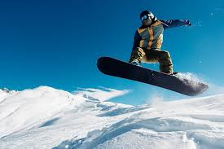

Areeba Ahmed

  
Home Page

  <button style="display: block; margin-bottom: 10px;">Button</button>

  <button onclick="window.location.href='http://127.0.0.1:4100/areeba_2025/csse/'">CSSE</button>
  
 These are some projects I worked on last year during CSSE 

<button onclick="window.location.href='http://127.0.0.1:4100/areeba_2025/snowboarding/'">Snowboarding</button>

 Some more info about me and snowboarding 

 Links 

  <a href="https://www.w3schools.com/html/default.asp" style="display: block; margin-bottom: 10px;">w3schools</a>

  <a href="https://github.com/areeba-ahmed/areeba_2025" style="display: block;">GitHub Page</a>

